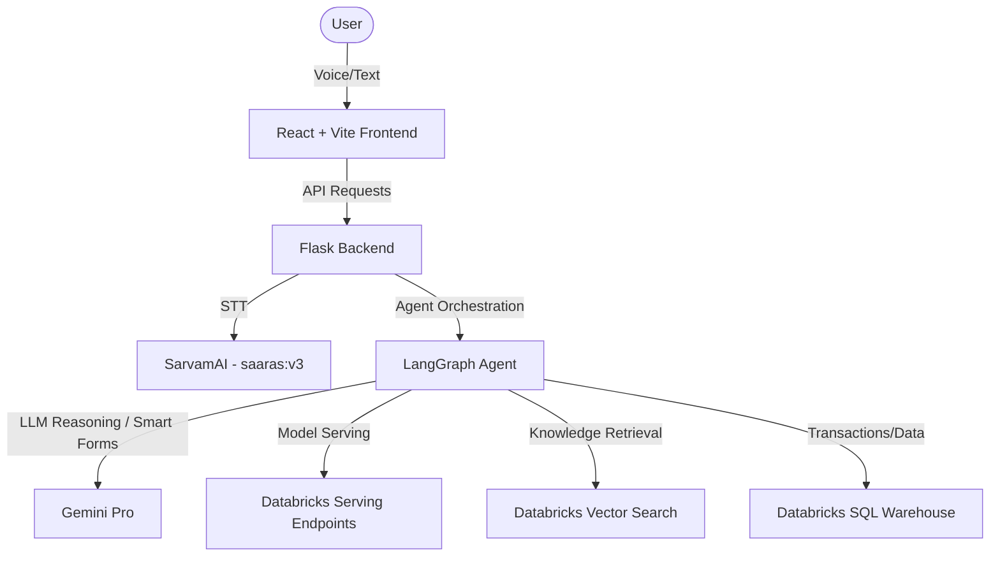
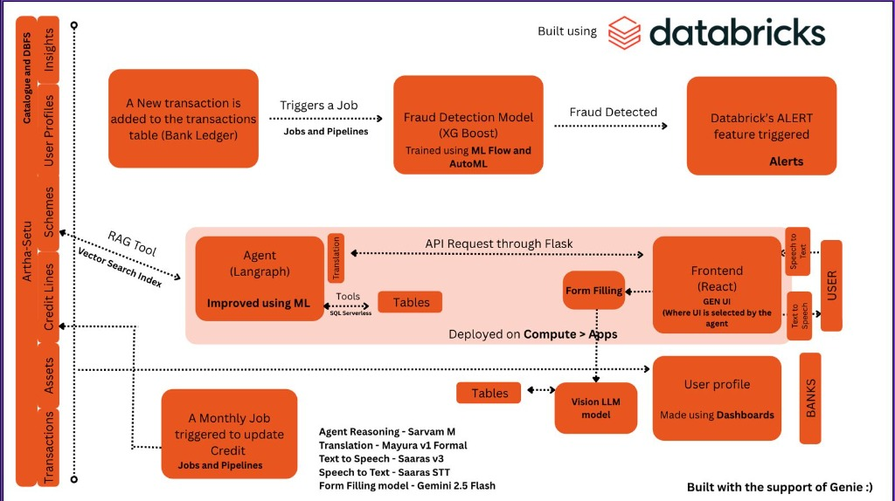

# Sahayak (Artha Setu)

Sahayak (Artha Setu) is an intelligent, voice-first financial assistant designed to help rural users in India seamlessly interact with financial services in their native languages. It features a Smart Form Agent that guides users through filling out physical documents using GenAI and speech interactions.

## Architecture





## How to Run

### 1. Prerequisites
- Python 3.10+
- Node.js 18+
- Databricks Workspace (with SQL Warehouse, Vector Search, and Serving Endpoints configured)

### 2. Backend Setup
1. Navigate to the `sahayak` directory:
   ```bash
   cd sahayak
   ```
2. Install Python dependencies:
   ```bash
   pip install -r sahayak/requirements.txt
   ```
3. Set your environment variables:
   ```bash
   export GEMINI_API_KEY="your_gemini_key"
   export SQL_WAREHOUSE_ID="your_warehouse_id"
   export SERVING_ENDPOINT="your_serving_endpoint"
   ```
4. Run the Flask server:
   ```bash
   python sahayak/backend/server.py
   ```

### 3. Frontend Setup
1. Open a new terminal and navigate to the `sahayak` directory.
2. Install Node dependencies:
   ```bash
   npm install
   ```
3. Start the Vite development server:
   ```bash
   npm run dev
   ```

## Demo Steps

1. **Access the Prototype**: Open your browser to `http://localhost:5173`.
2. **Text Interaction**:
   - Type in the chat: *"What is the procedure for PM Kisan Samman Nidhi?"*
   - The agent (via Databricks Vector Search and LangGraph) will fetch the appropriate guidelines and respond.
3. **Voice Interaction**:
   - Click the microphone icon and speak in Hindi/English: *"मुझे लोन चाहिए"* (I need a loan).
   - The system uses SarvamAI for STT and routes the intent.
4. **Smart Form Generation**:
   - Go to the Smart Form section.
   - Click "Upload Form" and choose a blank physical form image.
   - The system will engage in an assisted QA session to extract required fields contextually based on voice/text prompts.

## Project Write-Up

Sahayak (Artha Setu) bridges the digital divide in India's financial sector. Rural users often struggle with complex financial products, language barriers, and dense paper forms. We built Sahayak as a voice-first, multilingual GenAI assistant to simplify these interactions. It leverages Databricks for reliable Vector Search and secure SQL query execution, ensuring that financial inclusion is accessible, intuitive, and secure for the unbanked population.

## Technologies Used

**Databricks Technologies:**
* **Databricks Vector Search**: Used to semantically query and retrieve context regarding financial schemes and regulations.
* **Databricks SQL Warehouse**: For fast and secure querying of transactional data and product configurations.
* **Databricks Serving Endpoints**: To securely orchestrate AI models and LLM wrappers within the Databricks Lakehouse.

**Open-Source / Add-on Models:**
* **SarvamAI (saaras:v3)**: Highly accurate multilingual Speech-to-Text streaming model tailored for Indian languages.
* **LangGraph**: For autonomous agent workflow and state management.
* **Google Gemini API**: Base LLM for reasoning and multimodal Smart Form extraction.
* **React + TailwindCSS**: For an interactive and highly responsive Frontend experience.

---

### Hackathon Links

* **Demo Video**: [Insert YouTube/Vimeo Link Here]
* **Deployed Prototype**: [Insert Live App URL Here]
